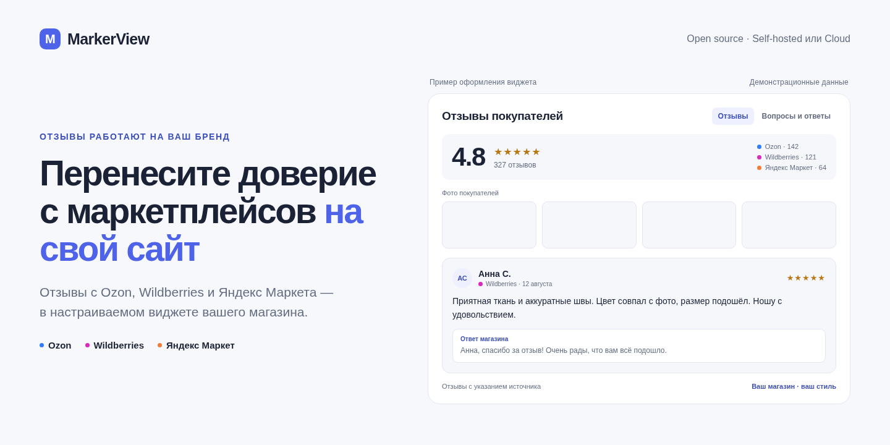

# MarkerView

**Перенесите доверие с маркетплейсов на свой сайт.**

Отзывы с Ozon, Wildberries и Яндекс Маркета — в настраиваемом виджете вашего интернет-магазина. Подключите источники, сопоставьте товары и управляйте публикацией из одной админки.

[](https://github.com/marker-oss/markerview/actions/workflows/ci.yml) [](LICENSE) [](https://github.com/marker-oss/markerview/releases) [](https://boosty.to/markerview)

[**MarkerView Cloud**](https://markerview.ru) · [**Запустить у себя**](#быстрый-старт) · [**Руководство**](docs/user-guide.md) · [**Планы развития**](#планы-развития)

<picture>
  <source media="(prefers-color-scheme: dark)" srcset="docs/assets/readme-hero-dark.png">
  <source media="(prefers-color-scheme: light)" srcset="docs/assets/readme-hero-light.png">
  
</picture>

*Пример оформления виджета. Демонстрационные данные; пустые плитки обозначают места для фото покупателей.*

## Для кого

Для брендов, которые уже продают на маркетплейсах и развивают собственный интернет-магазин. Если отзывы накоплены на площадках, а карточки на сайте пустуют, MarkerView помогает связать их с нужными товарами и показать покупателям.

Основной сценарий — **товарные отзывы**, а не общий рейтинг магазина. Для Яндекс Кита есть отдельная инструкция; на других сайтах можно использовать явную точку встраивания и передавать артикул товара.

## Что уже можно делать

| Задача | Возможности MarkerView |
|---|---|
| Собрать отзывы | Подключение Wildberries, Яндекс Маркета и Ozon, фоновая синхронизация и ручной запуск из админки |
| Связать отзывы с товарами | Сопоставление страниц магазина с артикулами через каталог и sitemap; явное указание SKU при встраивании |
| Подготовить публикацию | Модерация, фильтры, ответы магазина и работа с вопросами покупателей |
| Настроить внешний вид | Светлые и тёмные темы, раскладки, цвета, типографика, фото и видео; отдельные настройки для товара и главной страницы |
| Собрать отзывы на сайте | Форма с фото и видео; новые отзывы проходят модерацию |
| Управлять данными | Хранение в своей установке, HTTP API, статический экспорт, средства обезличивания и удаления данных |

**Доступ к источникам зависит от площадки и аккаунта продавца.** Нужны соответствующие API-ключи и права; Ozon по умолчанию выключен, доступ к отзывам зависит от подписки. [Подготовка ключей и ограничения](docs/user-guide.md#docker-подготовка-к-запуску).

## Cloud или self-hosted

Один продуктовый результат — живые отзывы на вашем сайте. Выберите, кто отвечает за эксплуатацию.

| | MarkerView Cloud | Self-hosted Core |
|---|---|---|
| Запуск | Облачный сервис | Docker Compose на вашем сервере |
| Эксплуатация | На стороне сервиса | Обновления, HTTPS и резервные копии — у вашей команды |
| Данные | В облачной установке | В вашей инфраструктуре |
| Начать | [markerview.ru](https://markerview.ru) | [Инструкция ниже](#быстрый-старт) |

**Core — полноценный open-source продукт под Apache-2.0**, без обязательной облачной учётной записи и платной активации. Cloud — способ использовать MarkerView без самостоятельного администрирования. Условия внешних API действуют для обоих вариантов.

## Быстрый старт

Нужны Git, Docker и Docker Compose. Compose сам собирает приложение: Go и Node.js на хосте не требуются.

```sh
git clone https://github.com/marker-oss/markerview.git
cd markerview
cp .env.example .env
```

Перед запуском настройте `.env`: укажите адрес магазина в `REVIEWS_SHOP_ORIGIN`, его sitemap в `REVIEWS_SITE_SITEMAP_URL` и замените пример `REVIEWS_SITE_PRODUCT_URL_TEMPLATE` на адрес своего магазина. Ключи маркетплейсов можно добавить после входа через админку.

```sh
docker compose up -d --build
curl --fail http://127.0.0.1:8080/healthz
```

Откройте [админ-панель](http://127.0.0.1:8080/admin/) на том же компьютере и создайте администратора. Данные сохраняются в Docker-томах.

### От первого входа до живого виджета

1. **Подключите источник.** Добавьте ключи нужного маркетплейса и запустите синхронизацию.
2. **Сопоставьте товары.** Обновите каталог магазина и проверьте артикулы и ссылки на карточки.
3. **Подготовьте отзывы.** Проверьте модерацию и настройте виджет в редакторе.
4. **Опубликуйте и встройте.** Скопируйте сниппет из раздела «Встраивание» в шаблон сайта или тег-менеджер; опубликуйте изменения.
5. **Проверьте карточку товара.** Откройте сайт как покупатель и убедитесь, что виджет показывает отзывы именно этого товара.

> **Для сайта нужен HTTPS.** Пример `.env` разрешает небезопасные cookie только для локального HTTP. Перед production уберите `REVIEWS_INSECURE_COOKIES=1`, настройте HTTPS и резервное копирование. Порт Compose привязан к `127.0.0.1`: на удалённом сервере сначала настройте reverse proxy. Не публикуйте `.env`, API-ключи и вывод `docker compose config`.

[Развёртывание и обновление](deploy/README.md) · [Подключение Яндекс Кита](docs/user-guide.md#быстрый-старт-яндекс-кит) · [Встраивание и диагностика](docs/user-guide.md#встраивание-виджета)

## Планы развития

От переноса отзывов — к сбору собственного контента и работе с обратной связью. Ниже запланированные направления, **не список уже доступных функций**. Сроки и порядок релизов пока не определены.

- **Отзывы после покупки.** Приглашения по email, связь с заказом и CMS/CRM; форма внутри поддерживаемых почтовых клиентов и веб-форма для остальных. Первый кандидат на интеграцию — Яндекс Кит.
- **ИИ-саммари товара.** Повторяющиеся достоинства и недостатки с опорой на исходные отзывы.
- **Новые источники и типы отзывов.** Раздельные отзывы о товаре, услуге и магазине, импорт CSV/JSON. Авито — приоритетный кандидат после проверки API и условий доступа.
- **Визуальный UGC.** Ленты фото и видео для бренда и товаров, модерация и учёт разрешений авторов. Поиск в соцсетях — в пределах подтверждённых возможностей конкретных площадок.
- **Безопасная автоматизация.** Настраиваемые ответы на типовые положительные отзывы, тегирование проблем и передача ответственному с отслеживанием результата.

Есть конкретная задача или пример того, что мешает работать с отзывами? [Расскажите в Issues](https://github.com/marker-oss/markerview/issues).

## Документация и участие

- [Руководство пользователя](docs/user-guide.md) — источники, админка, настройка, публикация и диагностика.
- [Развёртывание с Docker Compose](deploy/README.md) — домен, HTTPS и обновление.
- [Эксплуатация и безопасность](docs/technical/operations-and-security.md) — хранение, резервные копии и восстановление.
- [Для разработчиков](docs/technical/README.md) — архитектура, API и контракты; [локальная сборка и проверки](docs/technical/development.md).
- [Ошибки и предложения](https://github.com/marker-oss/markerview/issues) · [Pull requests](https://github.com/marker-oss/markerview/pulls).
- [Поддержать проект](SUPPORT.md) — Boosty и другие способы помочь развитию MarkerView.

Техническая основа: Go, SQLite или PostgreSQL, React-админка и JavaScript-виджет. Сборка из исходников без Docker описана для разработки, а не как второй пользовательский способ установки.

## Данные и права на контент

Перед публикацией проверьте условия API, право повторно использовать отзывы и медиа, разместите политику обработки данных и правила отправки отзывов. В проекте есть [шаблон политики](docs/legal/privacy-policy-template.ru.md) и технические средства работы с персональными данными, но они **не заменяют проверку применимых требований**.

Self-hosted даёт контроль над хранилищем, но не отменяет условия площадок и обязанности оператора. Не скрывайте достоверный негатив только ради повышения рейтинга.

## Лицензия и связь

[Apache License 2.0](LICENSE) — можно использовать, изменять и разворачивать в коммерческих проектах.

Вопросы о Cloud, помощь с установкой и доработки: [@pishite0suda в Telegram](https://t.me/pishite0suda). Общего community-чата пока нет; технические вопросы и предложения можно обсуждать в Issues.

---

**English:** MarkerView brings product reviews from Ozon, Wildberries and Yandex Market to a brand's own online store. It includes moderation, product mapping and an embeddable widget. Use the managed Cloud or run the full Apache-2.0 Core with Docker Compose. Marketplace API access and content-use permissions are required.
