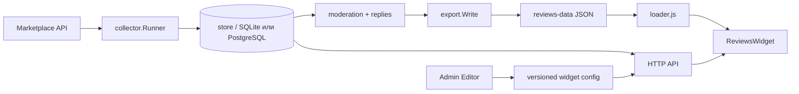

# Архитектура Core

[Навигация](README.md) · [Статус](status.md) · Срез исходников: 2026-09-17.

Документ для нового контрибьютора OSS. **Текущее** означает вывод из исходников, не проверку конкретного сервера; **принятое направление** — ещё не завершённую миграцию; **открытый вопрос** — поведение, которое нужно согласовать.

## Короткая карта

`Current.` В standalone OSS CLI [`runServe`](../../cmd/reviews/main.go) сам открывает store, создаёт `app.MarketplaceOperations`, собирает `server.Config`, подключает tenant export scope и запускает background loops. [`app.Serve`](../../internal/app/app.go) использует общую wiring-модель и нужен, в частности, cloud-сборке; это не означает, что OSS CLI просто вызывает `app.Serve`.

### Границы исходников

| Область | Владелец | Точка входа |
| --- | --- | --- |
| Запуск процесса | `cmd/reviews` и `internal/app` | [`runServe`](../../cmd/reviews/main.go), [`app.Serve`](../../internal/app/app.go) |
| HTTP, tenant-scope, CORS | `internal/server` | [`Server.handler`](../../internal/server/server.go) |
| Данные и транзакции | `internal/store` | [`Store.UpsertReview`](../../internal/store/reviews.go), модели в [`models.go`](../../internal/store/models.go) |
| Сбор с площадок | `internal/collector` + `internal/marketplace` | [`Runner.RunOnce`](../../internal/collector/collector.go), [`Adapter`](../../internal/marketplace/model.go) |
| Публичная форма JSON | `internal/reviewjson` | [`Mapper.ToReview`](../../internal/reviewjson/reviewjson.go) |
| Статический экспорт | `internal/export` | [`BuildBundles`](../../internal/export/export.go), [`Write`](../../internal/export/export.go) |
| Админская настройка | `web/admin` + `internal/server` | [`Editor.tsx`](../../web/admin/src/pages/Editor.tsx), [`admin_widget_config.go`](../../internal/server/admin_widget_config.go) |
| Встраивание | `web/reviews-widget` | [`loader.js`](../../web/reviews-widget/loader.js), [`reviews-widget.js`](../../web/reviews-widget/reviews-widget.js) |

## Текущий runtime-flow

### 1. Marketplace → collector → store

`Current.` `runServe` (standalone CLI) или [`app.Serve`](../../internal/app/app.go) создаёт store, HTTP-сервер и фоновые циклы. Синхронизация вызывает `collector.Runner.RunOnce`; для каждой площадки выбирается адаптер по имени. Один запуск получает `SyncRun`, читает [`SyncState`](../../internal/store/models.go), идёт от watermark с overlap, перелистывает cursor и вызывает `UpsertReview` для каждой записи.

`UpsertReview` выполняется транзакционно: ищет связь товара по `(tenant_id, marketplace, external_product_id)`, а отзыв — по `(tenant_id, marketplace, external_review_id)`. Новая запись получает `imported`; обновление сохраняет статус, видимость, закрепление и административный ответ, но текстовые поля источника может перезаписать. Media синхронизируется в той же транзакции. Имя автора анонимизируется, `Raw` очищается.

Второй, необязательный проход адаптера получает вопросы. Ошибка вопросов логируется и не делает review-sync ошибочным. После новых отзывов store помечается dirty для статического экспорта. Затем сохраняются watermark и итог `SyncRun`; ошибка финализации только логируется.

### 2. Store → moderation

`Current.` Импортированные отзывы видимы по умолчанию согласно данным площадки, а site-review создаётся как `status=pending`, `visibility=hidden`. Админские методы в [`admin_reviews.go`](../../internal/server/admin_reviews.go) меняют статус/видимость, редактируют текст, удаляют или восстанавливают отзыв, закрепляют его для showcase. Ответ продавца и ответ на вопрос имеют отдельное состояние публикации и ошибку.

Экспорт и live API используют публичное представление из [`reviewjson`](../../internal/reviewjson/reviewjson.go). Оно определяет поля выдачи, ссылки и политику маркетплейсов. Видимость конкретного отзыва фильтруется отдельно в запросах store; `Mapper.ReviewHidden` проверяет скрытие маркетплейса, а не заменяет всю модерацию.

### 3. Store → export/API → loader/widget

`Current.` Публичные маршруты регистрируются в [`Server.handler`](../../internal/server/server.go): reviews, showcase, widget config, submission/question config, submissions, questions, preview, media и health. `GET /api/reviews` отдаёт live JSON через тот же mapper; `/api/questions` пока live-only.

Публикация [`publishReviewsData`](../../internal/server/admin_publish.go) получает видимые отзывы, строит bundles и links, затем записывает их во временный каталог через [`export.Write`](../../internal/export/export.go) и переключает каталог экспорта. Прямой CLI export использует более низкоуровневую запись файлов. Bundle содержит article, aggregate и reviews; links связывает путь/ID товара сайта с артикулом. Автопубликация обрабатывает dirty-маркер, поэтому база и файлы не обновляются мгновенно вместе. Не приписывайте `export.Write` гарантию атомарной смены всего набора: она зависит от вызывающего пути.

`loader.js` получает `REVIEWS_EMBED_CONFIG` (или data-атрибуты), нормализует article, строит URL bundle и при необходимости добавляет `public_key`. Для SPA он отслеживает навигацию, подгружает JSON, CSS/JS и монтирует Shadow DOM. Если live API нужен (вопросы, отправка отзыва, динамический режим), loader/widget строит `/api/*` URL на том же `serviceBase`.

## Editor → config → publish

`Current.` [`Editor.tsx`](../../web/admin/src/pages/Editor.tsx) загружает `/admin/api/widget-config/{context}` и список версий. Локальный черновик хранится в `localStorage` как `reviews-draft-product` или `reviews-draft-homepage`; он не является серверной публикацией. [`mergeWidgetConfig`](../../web/admin/src/widgetConfig.ts) нормализует неполный payload к текущему клиентскому default.

POST на `/admin/api/widget-config/{context}` в store транзакционно выключает старые active-версии и создаёт следующую целочисленную версию. Rollback лишь меняет active-флаг существующей версии. Публикация config делает export dirty, потому что marketplace policy и форма могут влиять на публичный результат. `context` сейчас ограничен product/homepage проверкой server handler.

`Accepted target (не реализован).` Нужен единый shared config contract для editor, server и widget: одна схема версий, нормализация и публикация, без замены Core-файлов частным overlay. Сегодня TS-редактор и JS-widget частично дублируют defaults/normalization; при изменении полей сначала нужно обновить фактических потребителей и обратную совместимость.

## Tenant, auth и extension boundary

`Current.` В OSS store создаёт implicit tenant 1. В strict tenant mode public API и static export требуют `public_key`; в compat mode запросы без ключа обслуживают tenant 1. `tenantScope` проверяет ключ, origin tenant и paused status. Public key идентифицирует tenant и **не является секретом или логином**.

Админ использует session cookie; `requireSession` помещает tenant и user ID в context. Store-методы должны явно сохранять tenant-фильтр: middleware сам по себе не делает произвольный GORM-запрос безопасным. `AdminUser.Role` позволяет дополнительным обработчикам проверять полномочия отдельно от наличия сессии.

[`app.Options`](../../internal/app/app.go) предоставляет точки подключения дополнительных миграций, маршрутов и правил. Он передаёт `Store`, `Server` и GORM-типы, поэтому пока связан с внутренними API и схемой данных, а не является стабильным внешним SDK. Нулевые настройки сохраняют базовый режим без закрытых дополнений. Их конкретную реализацию публичная документация не дублирует.

`Accepted target (не реализован).` Shared OSS `App` должен оставаться общим, а private Auth/Billing/Operator подключаться additive hooks, без замены `App.tsx`/core-файлов и без plugin framework или microservices. Private build может идти в том же Go module на первом этапе. Это граница композиции, не доказательство готовности cloud.

## Standalone OSS

`Current.` Один бинарник может обслужить один implicit tenant, хранит базу локально, отдаёт статические widget assets и `reviews-data`, поддерживает marketplace credentials, sync, moderation, live API и публикацию. Пустой `REVIEWS_CREDENTIALS_KEY` оставляет credentials plaintext для совместимости single-tenant; заданный ключ включает sealing и миграцию существующих строк.

Сетевые вызовы к marketplace — через adapters; HTTP API и export не требуют отдельной очереди или внешнего сервиса. `noCacheStatic` заставляет браузер перепроверять изменяемые assets. Ошибки auto-publish не удаляют последнюю успешную выгрузку, но задерживают её обновление.

## Известные ограничения

- Вопросы сейчас не входят в static bundle; публичная выдача — live API.
- Один ключ credentials уникален для пары tenant+marketplace; несколько seller accounts одной площадки не поддержаны.
- Draft editor живёт в браузере и не восстанавливается на другом устройстве.
- Config version — published payload, отдельной server-side draft-сущности нет.
- Export и live API могут кратко показывать разные snapshots; строгой межфайловой атомарности нет.
- `ProductName` и `ProductPrice` — сырые факты, присланные marketplace, а не authoritative commercial catalog.
- Исторические design specs могут описывать несуществующие endpoints; source links выше имеют приоритет.

`Open question.` Нужны политика retention для media/DSR, стратегия нескольких credentials на marketplace и окончательный shared schema/versioning contract. До решения не следует документировать их как реализованные возможности.
